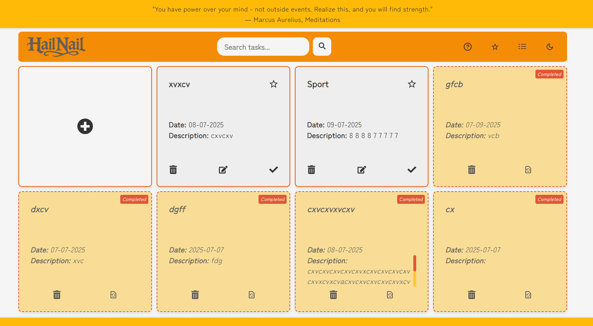
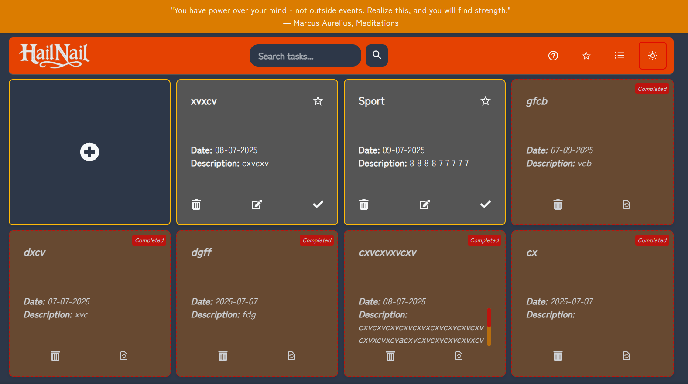
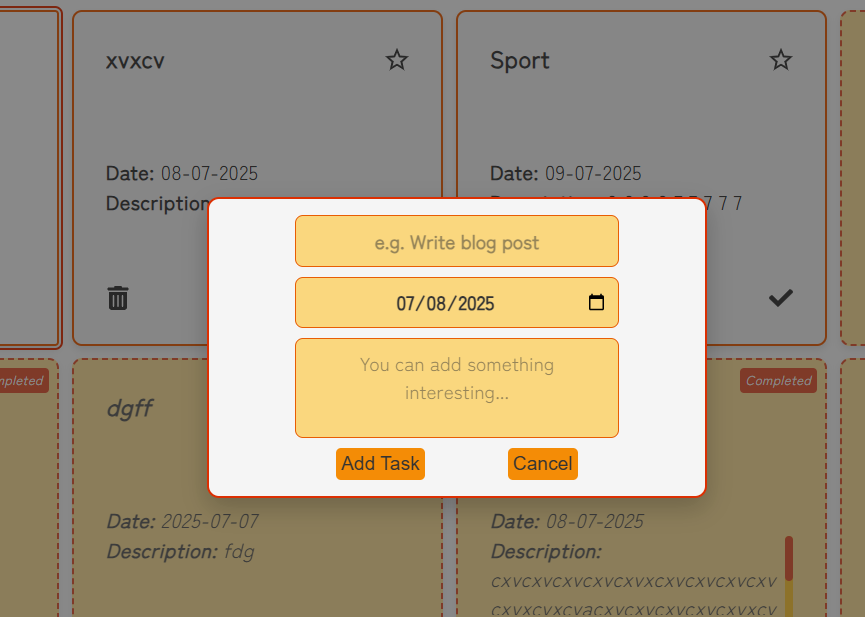
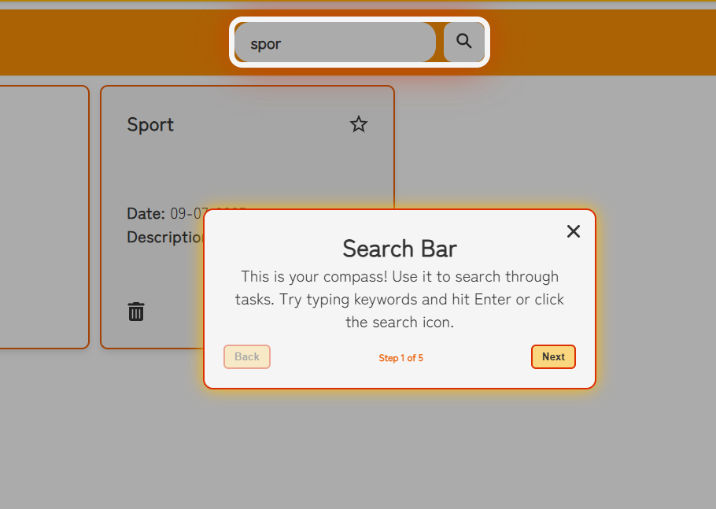
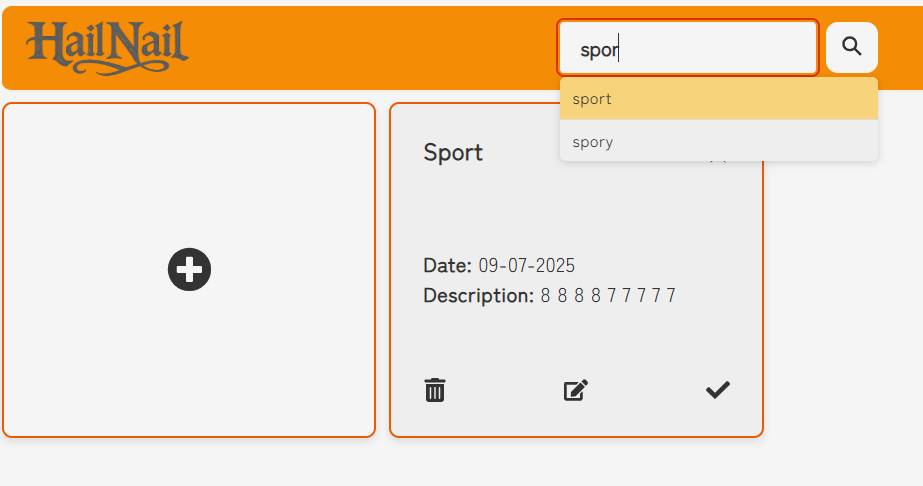

# 🗂️ React Task Manager

A beautiful, responsive, and intuitive task manager built with React.  
This app allows users to add, edit, delete, and mark tasks as complete, search through them, toggle favorites, switch views, and explore features like ghost cards and guided modals.

---

## ✨ Features

- 📝 Add, Edit, Delete tasks with modal forms
- 🌟 Mark tasks as favorite and filter them
- 🔍 Powerful search with history suggestions
- 🧠 Smart layout: switch between Grid and List
- 🧪 Ghost task zone for completed items
- 🧰 Guide modal for new users
- 🎨 Dark mode toggle
- 🍔 Responsive hamburger menu on mobile

---

## 📸 Screenshots

```







```

## 🧑‍💻 Tech Stack

- **React**
- **JavaScript**
- **Custom Hooks** (`useTaskManager`, `useSearch`, `useVisibleTasks`)
- **CSS Modules** & `react-icons`
- **LocalStorage** for persistence
- **Responsive design** with media queries

---

## 🚀 Getting Started

### 1. Clone the repository

```bash
git clone https://github.com/your-username/task-manager.git
cd task-manager
```

### 2. Install dependencies

```bash
npm install
```

### 3. Start the development server

```bash
npm start
```

---

## 📦 Build

To build the production version:

```bash
npm run build
```

---

## 🙌 Acknowledgements

- Marcus Aurelius for stoic clarity 🏛️
- Coffee, lo-fi beats, and consistency ☕🎧
- React docs, ChatGPT, Gemini, mdn web docs, HuXn WebDev

---

## 📬 Contact

> Want to collaborate or suggest features?

Feel free to open an issue or reach out:  
**[theproducer228@gmail.com]**  
GitHub: [@HailNail](https://github.com/HailNail)

---

> “What stands in the way becomes the way.” — _Marcus Aurelius_
